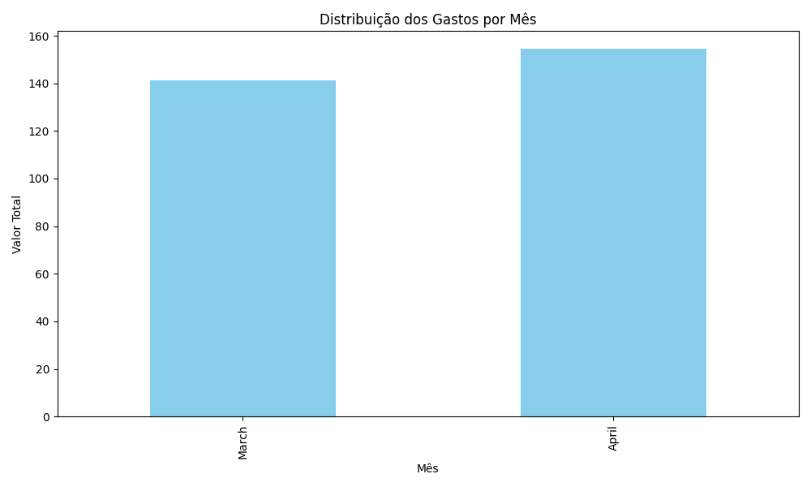

# 📊 Análise de Despesas Pessoais com Python

Projeto desenvolvido com foco educacional e prático, utilizando **Python e bibliotecas de ciência de dados** para analisar e visualizar gastos pessoais a partir de um arquivo `.csv`.

---

## 🎯 Objetivo

Automatizar a leitura de dados financeiros e gerar análises com gráficos e um relatório Excel completo, usando:

- `pandas` para análise de dados  
- `matplotlib` para visualização  
- `openpyxl` para exportação

---

## 📁 Estrutura do Projeto

```
analise-despesas-pessoais/
├── dados/
├── imagens/
├── relatorios/
├── src/
├── README.md
└── requirements.txt
```

---

## ▶️ Como Executar o Projeto

```bash
git clone https://github.com/juhcavole/analise-despesas-pessoais.git
cd analise-despesas-pessoais
python -m venv venv
.venv\Scripts\activate
pip install -r requirements.txt
python src/main.py
```

---

## 🧾 Exemplo de Arquivo CSV

```csv
Data,Categoria,Descricao,Valor
2024-04-01,Alimentacao,Supermercado,120.50
2024-04-02,Transporte,Onibus,4.40
```

---

## 📈 Gráficos Gerados

### 📌 Distribuição por Categoria


### 📌 Gastos por Mês


---

## 📤 Saída Final

📊 `relatorios/relatorio_gastos.xlsx` com:
- Gastos originais
- Resumo por categoria
- Resumo por mês

---

## 🛠 Tecnologias


---

## 🙋‍♀️ Autora

Desenvolvido por **Juliana Cavole**  
💼 Professora de programação, apaixonada por dados, educação e tecnologia.

[🔗 GitHub: @juhcavole](https://github.com/juhcavole)

---

## 🪪 Licença

Este projeto está licenciado sob a **MIT License**.  
Sinta-se à vontade para usar, estudar e compartilhar!
